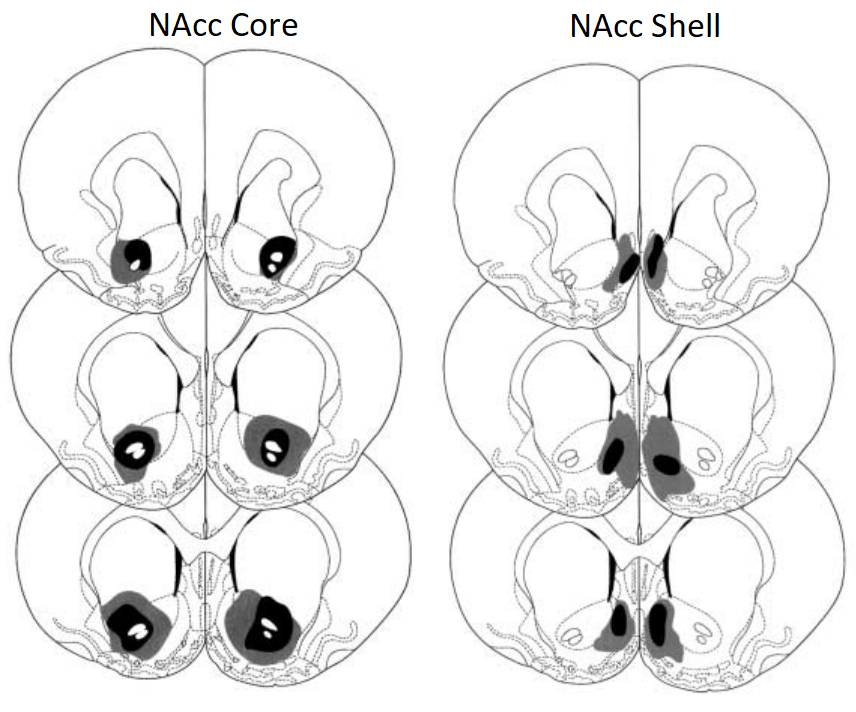
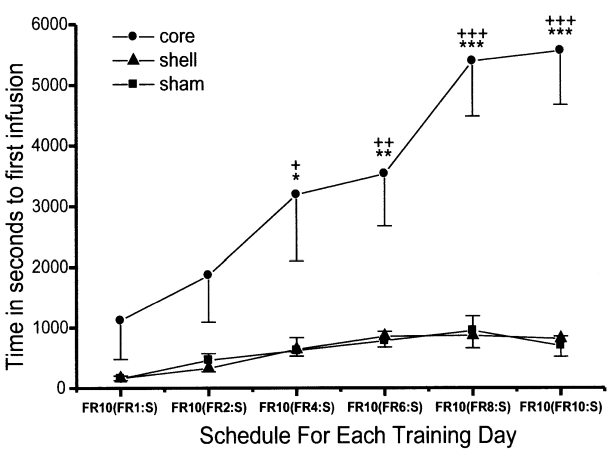
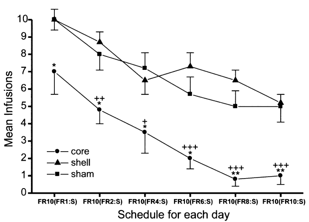

```{r setup, include=FALSE}
options(htmltools.dir.version = FALSE, echo=FALSE,warning=FALSE,message=FALSE)
library(tidyverse)
```

<center>

# Quantification of Behaviour in Neuroscience

### Jennet Baumbach

### September 15th 2023


---

## The Importance of Behaviour to Neuroscience 

--

### **Behaviour**: The activity of an organism interacting with its environment. 

--

- Naturalistic behavioural patterns are not synonymous with stimulus responses. 

--

- In laboratory settings, we primarilly study stimulus responses. 

--

### **Monistic** view point: behaviour is the summated output of the underlying neural processes. 

--

- Alterations in behavioural output represents changes in the underlying neuronal processes

---

# Historical Perspective

--

### The mind-body problem (aka monism vs. dualism)

--
    
- **Dualism**: the idea that the mind and body are separate (distinct) entities

--

- Aristotle (300 BCE), Plato (400 BCE), Rene Decartes (1600's)

--

- Rationalized that the body and the "soul" or the "mind" were clearly distinct 

--
    + the death of the body is separate from the existence of the soul

---

# Historical Perspective

--

### Early neuroscience (1800's - 1950's) relied heavilly on behaviour. 

--

Clinical case studies: e.g. [Phineas Gage (1848)](https://www.ncbi.nlm.nih.gov/pmc/articles/PMC7735047/#:~:text=Gage's%20case%20is%20considered%20to,personality%2C%20emotions%20and%20social%20interaction.&text=Prior%20to%20this%20case%2C%20the,and%20unrelated%20to%20human%20behavior.)

--

.pull-left[

]

--

.pull-right[

]

--

**Post-injury behavioural patterns** provided support for cerebral localization and information about the role of the damaged brain region (PFC).

---

# Historical Perspective

--

- The dualist perspective was challenged by increasing support for the connection between brain and mind during the 1800's 

--
    + Rather than dualism being "disproven", science adopted the monistic viewpoint because of the volume of evidence to support it.

--

- [Paul Broca (1861)](https://en.wikipedia.org/wiki/Paul_Broca) linked behavioural defects in clinical populations with brain lesion (identified during post-morterm analysis)

--
    + Indicated that there was localization of specific cognitive function distributed across the cortex.
    
--

<center>


    
---

# Historical Perspective

--

### 1900's-recently, focus shifted towards molecular approaches.E.g.:

--

.pull-left[


]

--

.pull-right[

- A complex behaviour (here, freezing behaviour) is reduced to a mechanisms represented at the level of a single neuron. 

- Has provided many pieces of insight about the molecular processes that contribute to to complex behaviour

- Fundmentally lacks qualitative information about *how* these processes produce the behaviour in the context of the system.

]
---

# Historical Perspective

--

### Recent renewed interest in the study of behaviour 

--

- Behaviuoral work can aim to *understand* in ways that neural interventions cannot. 
    +  Complex behavioural characterization should precede the formation of neural hypotheses.

--

- Criticism of approaches that involve inference of cognitive processes from neural processes (e.g. [mirror neurons: Caslie et al. 2011](https://www.semanticscholar.org/paper/The-Mirror-Neuron-System-Casile-Caggiano/a3357d5d183cdd47ecbe352f34d7aec7e37fd8a0))

--
    + And clear separation of results versus interpretations. 
    
--

.footnote[[Neuroscience needs behaviour: correcting a Reductionist Bias (Krakauer et al., 2017)](https://www.cell.com/action/showPdf?pii=S0896-6273%2816%2931040-6)]
    
---

# The Connection between Brain & Behaviour

--
    
<center>


</center>

The **result** is that similar patterns of neural firing were observed when the individual performs the behaviour, or, when the individual watches another perform that same behaviour. 

The **interpretation** has been that the patterns of firing represent some levels of "understanding". 

---

# Historical Perspective

--

### Recent renewed interest in the study of behaviour 
  
--

- Technological developments improve the speed and accuracy in collecting behavioural data.

--

- Producing more complex datasets

--

- Which facilitate more comprehensive analytic approaches

---

## Animal Behaviour as a Readout for Brain Function

--

### Lesion studies

--

- A loss of a specific behaviour after a specific brain region allows researchers to infer the functionality of the brain region. 

--

<center>

```{r,echo=FALSE,out.width="50%"}

```

</center>

.footnote[[Hutcheson et al. 2022](https://link.springer.com/article/10.1007/s002130000635)]

---

## Animal Behaviour as a Readout for Brain Function

### Lesion studies

- A loss of a specific behaviour after a specific brain region allows researchers to infer the functionality of the brain region. 

--

.pull-left[

```{r,echo=FALSE}

```
]

--

.pull-right[

```{r,echo=FALSE}

```

]

--

<center>

<b>The lesion approach does not inform about <i>how</i> the brain region contributes to the behaviour</b>.

</center>

.footnote[[Hutcheson et al. 2022](https://link.springer.com/article/10.1007/s002130000635)]
  
---

## Animal Behaviour as a Readout for Brain Function

--

### Developmental perspective

--

- Changes in behavioural output across the lifespan suggest alterations in brain maturation.

--

<center> 


</center>

.footnote[[Shoji et al. 2016](https://www.ncbi.nlm.nih.gov/pmc/articles/PMC4730600/)]

---

# Behavioural Paradigms in Research

--

### The importance of well-defined behavioural tests

--

#### Reliability (*does the measure produce consistent results*)

--

- test-retest reliability (within or between individuals)

--

- inter-rater reliability

--

#### Validity (*are you really quantifying what you think you're measuring?*)

--

- face validity - Does it "check out"? 

--

- pharmacological validity - Do pharmaceutical agenst that are known to regulate the processes that the measure is assumed to capture alter the behaviour in the expected ways? 
  + e.g. administration of an anti-anxiety drug should increase anxiolytic behaviour..
  
--

- translational validity

---

# Behavioural Paradigms in Research

--

### Example: Tasks to investigate memory in the lab

--


Non-aversive memory measures 

--

- Operate on the basis that animals have a **preference for novelty**

--

  + Robust cross-species examples of this preference

--

<center>


---

# Behavioural Paradigms in Research

--

### Example: Tasks to investigate memory in the lab

--

Aversive memory measures 

--

- Operate on the basis that animals fear pain 

--

  + Robust cross-species examples of this behaviour 
  
--
  
<center> 


---

## Tapestry Analogy

--

- Courtesy of [Prof. Dawn Good](https://brocku.ca/social-sciences/psychology/people/dawn-good/)

--

.pull-left[

]

--

.pull-right[

]

---

## Challenges and Limitations

--

### Variability in animal behaviour

--

- Both between and within individuals

--

### Complex Nature of Animal Behavior

--

- Contextual considerations: generally animals are tested one at a time in novel behavioural contexts. 

--

- Natural complexities: very difficult to confidently identify playing versus aggressive behaviour

--

### Animal Origens

--

- Selective breeding for desireable lab characteristics has unknown influences on animals' behavioural output. 

---

# Hierarchical Framework of Scientific Thought

--

### **Theory**: A unifying scientific concept that is supported by many individual pieces of evidence. 

--

- Examples: Evolution, relativity, synaptic plasticity in neuroscience. 

--

- Individual scientists do not generally interact directly with theories on a day-to-day basis

--
    + e.g. no grant proposal aims to tackle a theory. 


--

- Acts as the conceptual starting point for researchers. 

---

# Hierarchical Framework of Scientific Thought

--

### **Model**: deals with one chunk of a scientific theory

--

#### (1) Unifying models 

--

Are large, and typically fairly crystallized.

--

- e.g. the genetic basis of inheritance, epigenetics, LTP in neuroscience. 
    + Provide mechanistic insight into the overarching theory of evolution. 

--

#### (2) Working models

--

Which are typically smaller in scope and often more flexible. 

--

- A unifying model could encompass many working models

--

- e.g. Epigenetics: DNA methylation, histone modifications. Neuroscience: changes in dendritic shape / density .

---

# Hierarchical Framework of Scientific Thought

--

### **Hypothesis**: isolates one experimentally-testable aspect of a a working model. 

--

- Facilitates the formation of *testable predictions* that are usually directional in nature. 

--

- A hypothesis can never be "proven correct" - it can only be "not disproven" 

--
    
- A hypothesis gains support through repeated testing of its predictions. 

--

- The wording of the hypothesis should lend itself well to discussion and rigorous experimental design.

--

- "Hypothesis driven" writing is the gold standard for research reports, grant applications and thesis projects.

--

- e.g. in LTP, could form a hypothesis: synaptic strengthening facilitates long-term memory via the NMDA receptor 

---

# Hierarchical Framework of Scientific Thought

--

### **Experiment**: An emperically designed series of steps designed to investigate the predictions that arise from the hypothesis. 

--

- Involves some kind of control group.

--

- Either quasi-experimental or true experimental design. 

--
    + quasi- examples: Males versus females, clinical populations versus healthy control group. 

--

- Differentiation from "study" in psychology.

---

# Hierarchical Framework of Scientific Thought

--

### **Measure** or **Assay**: A specific endpoint that will produce interpretable data. 

--

- e.g. a specific behavioural task or laboratory assay. 

---

# Styles of Experiments 

--

#### 1. Observe: An initial observed association between two things (e.g. A, C) initiates the research design process. 

--

Design hypothesis: A -> B -> C 

--

#### 2. Measure: Confirm that A causes B

--

#### 3. Block: inhibiting B should prevent A from causing C

--

Design an experiment to prevent B while leaving the processes that cause A and C intact (necessity)

--

#### 4. Mimic: experimentally manipulating B should prdoduce C 

--

Design an experiment to alter B to investigate whether this will produces C in the absence of A (sufficieny)

--

.footnote[[David Sweatt - Mechanisms of memory textbook ](https://www-sciencedirect-com.myaccess.library.utoronto.ca/science/article/pii/B9780123749512000044?via%3Dihub)]

---

## Future Directions in animal behavioural research

--

#### Improvements in the quantification of behavioural data provide richer, more complex datasets.

--

- Much more efficient (e.g. eliminiates the need to sit scoring videos for many hours)

--

- Can use an exhaustive approach combined with unbiased clustering methods. 

--

.pull-left[

]

--

.pull-right[

]

---

## Future Directions in animal behavioural research

--

### Improvements in the complexity of statistical analysis allow for richer interpretatins about behavioural patterns 

--

- e.g. Time-series based analyses (a concept borrowed from finance)

--

<center>


---

<center> 

# Questions ? :) 

---

```{r,echo=FALSE,warning=FALSE,message=FALSE,out.width="65%",fig.align='center'}
library(pdftools)
library(magick)
library(usethis)
a <- magick::image_read_pdf("Notetaker_Flyer.pdf",pages=1)
a
```


